# NXP Application Code Hub

## Interactive Ping Pong Game Demo Using the MCXN947 Click Shield with OLED C Display and Dual Joystick Click Boards

This application showcases the MCXN947 MCU integrated with the MikroE Click Shield, featuring three Click Board slots. The demo utilizes an OLED C Click display and two Joystick Click Boards, with MCXN947 pins configured to route signals precisely to each slot. The final implementation delivers an interactive ping pong game, where players control paddles using the joysticks and view gameplay on the OLED screen. This project highlights the MCXN947’s flexibility in handling multiple peripherals and provides a fun, hands-on example of embedded graphics and input handling using NXP’s development ecosystem.

#### Boards: FRDM-MCXN947
#### Categories: Graphics
#### Peripherals: GPIO, I2C, SPI
#### Toolchains: MCUXpresso IDE

## Table of Contents
1. [Software](#step1)
2. [Hardware](#step2)
3. [Setup](#step3)
4. [Results](#step4)
5. [FAQs](#step5) 
6. [Support](#step6)
7. [Release Notes](#step7)

## 1. Software
- [MCUXpresso 11.10.0 or newer.](https://nxp.com/mcuxpresso)
- [MCUXpresso for VScode 24.8.9 or newer](https://www.nxp.com/products/processors-and-microcontrollers/arm-microcontrollers/general-purpose-mcus/lpc800-arm-cortex-m0-plus-/mcuxpresso-for-visual-studio-code:MCUXPRESSO-VSC?cid=wechat_iot_303216)
- [SDK for FRDM board](https://mcuxpresso.nxp.com/en/select)

## 2. Hardware
- [FRDM MCXN947](https://www.nxp.com/design/design-center/development-boards-and-designs/FRDM-MCXN947) 
[
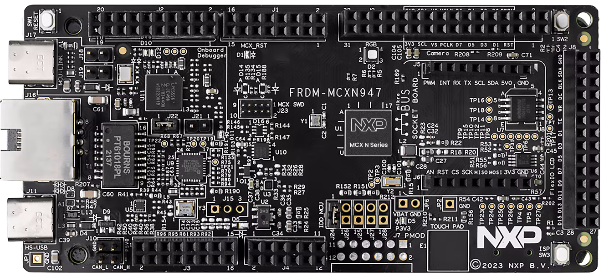
](Images/MCXN947.png)
- [MIKROE OLED-C-CLICK](https://www.mikroe.com/oled-c-click?srsltid=AfmBOooNlbEL_d7yp2V02oRGcli8C5SckWFb2oM5yQXEzkpndQomGdzG#/263-clickid-yes)   
[
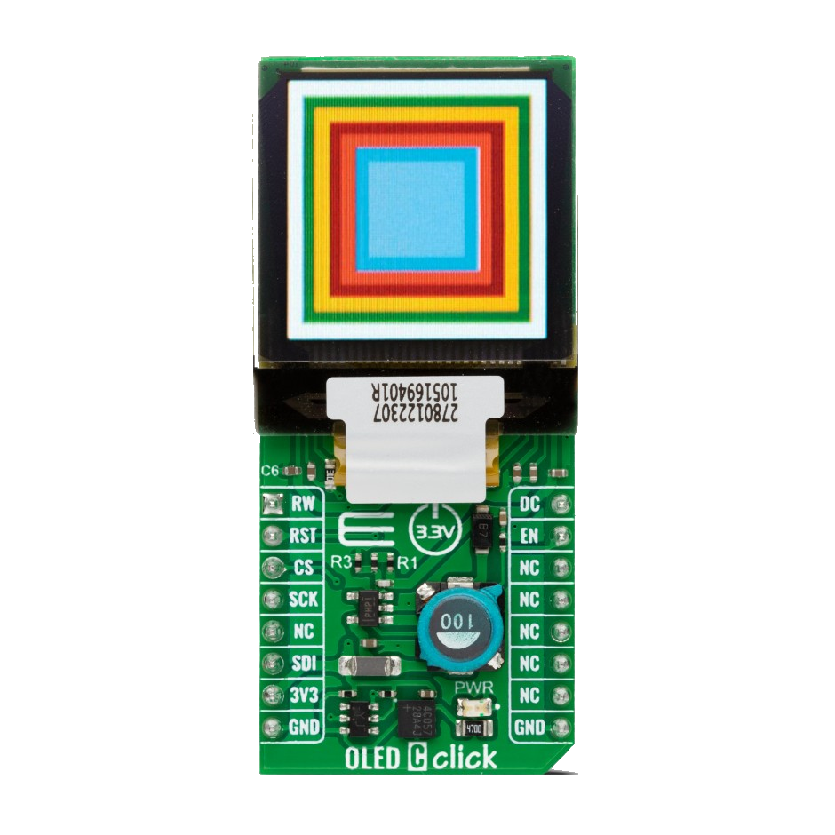
](Images/oledcclick.png)
- [MIKROE JOYSTICK-2-CLICK](https://www.mikroe.com/joystick-2-click?srsltid=AfmBOorQZPZJpp5roaGLXWkFA7Ox24M9aRgQfSTbwTiaCoG0nbVRSHwW)   
[
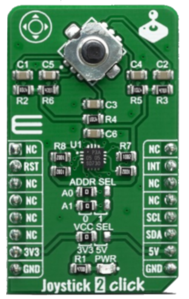
](Images/Joystick2Click.png)
- [MIKROE CLICK SHIELD FOR FRDM-MCXN947](https://www.mikroe.com/click-shield-for-frdm-mcxn947?srsltid=AfmBOopU9IFqgkaLsUFA_KYIPIuYSzpWi3xRo7MvR2TioUyGzBIInXN3)   
[
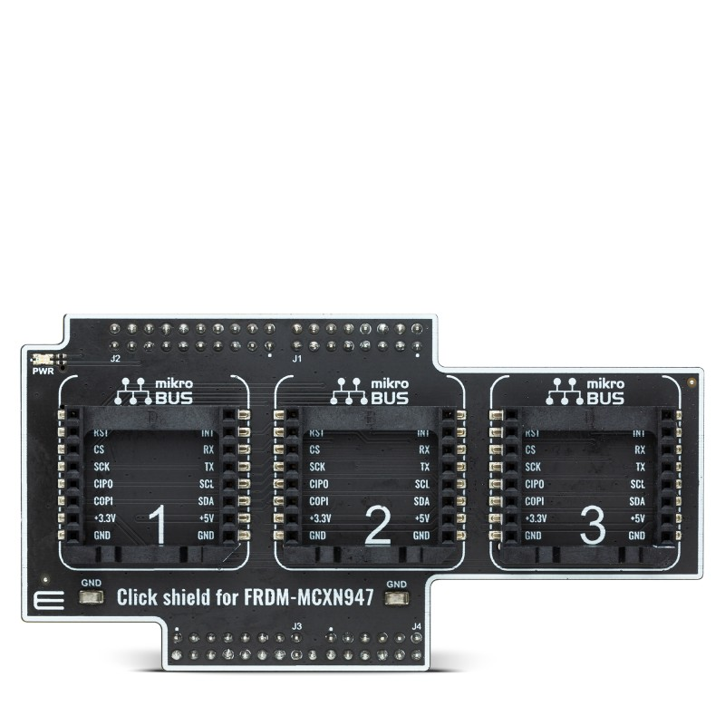
](Images/click_shield_for_mcxn947.png)

## 3. Setup

It is needed to change de address selector of the joystick in the slot 1, change A0 from 0 to 1, as shown below.
[
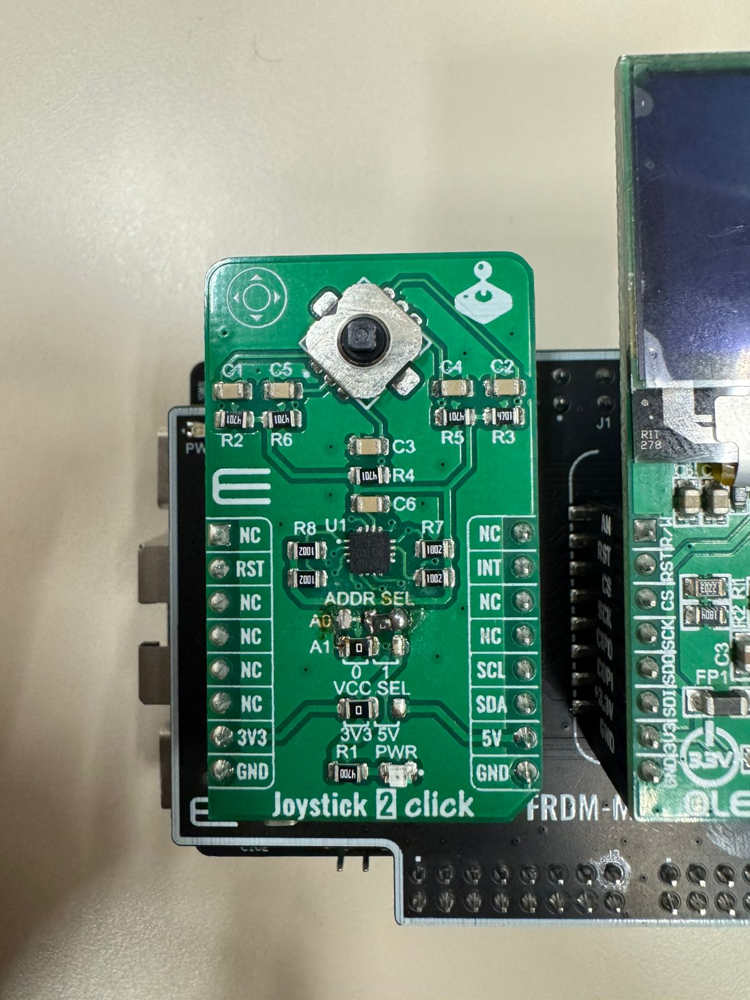
](Images/addr_sel.png)

[
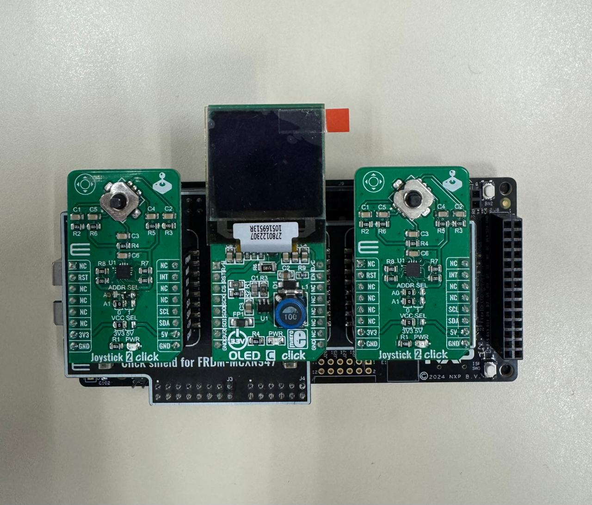
](Images/setup.png)

### 3.1 Import Project

select "File" in window bar, and then select "Import"
[
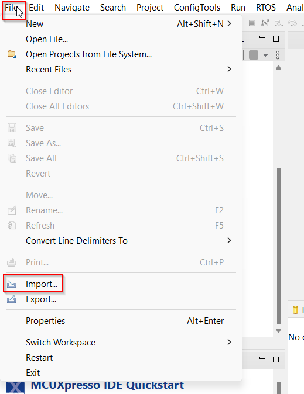
](Images/File_Import.png)

select Application Code Hub and then click "Next"
[
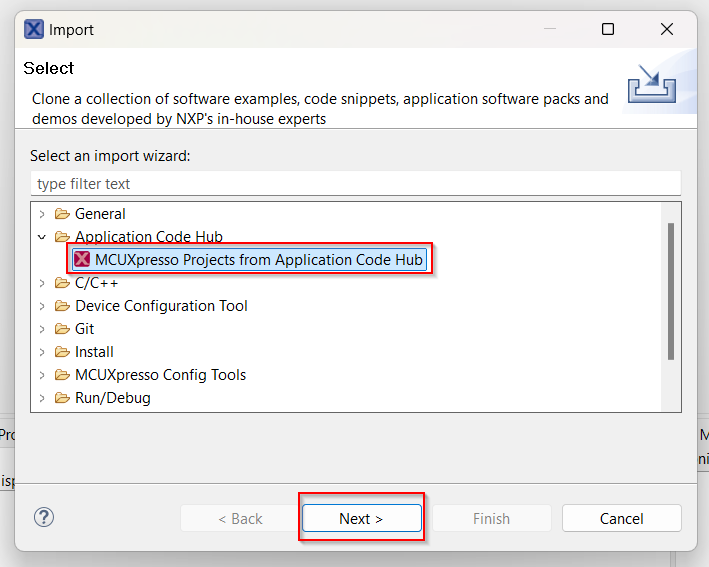
](Common/Images/ACH.png)

find the Demo "click shield for MCXN947"
[
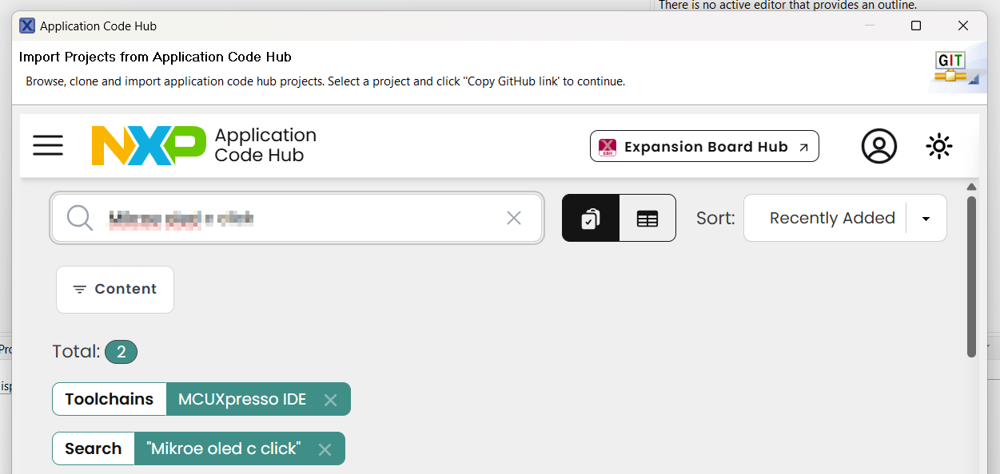
](Images/Find_Demo.png)

select the Demo and then click "GitHub link"
[
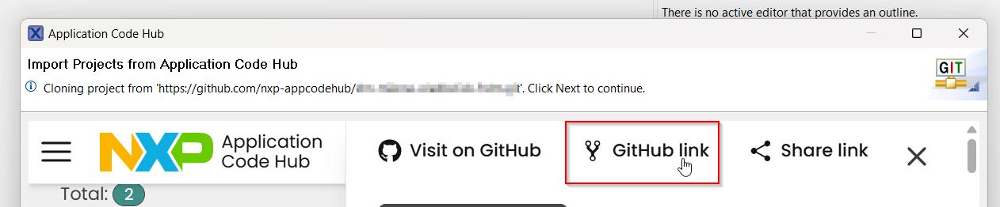
](Images/Github_Link.png)

now click "Next"
[
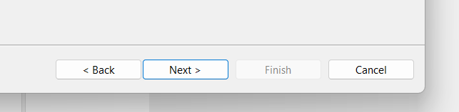
](Images/Github_Next.png)

select main branch
[
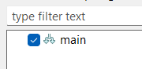
](Images/main.png)

select your directory path and click "Next"
[
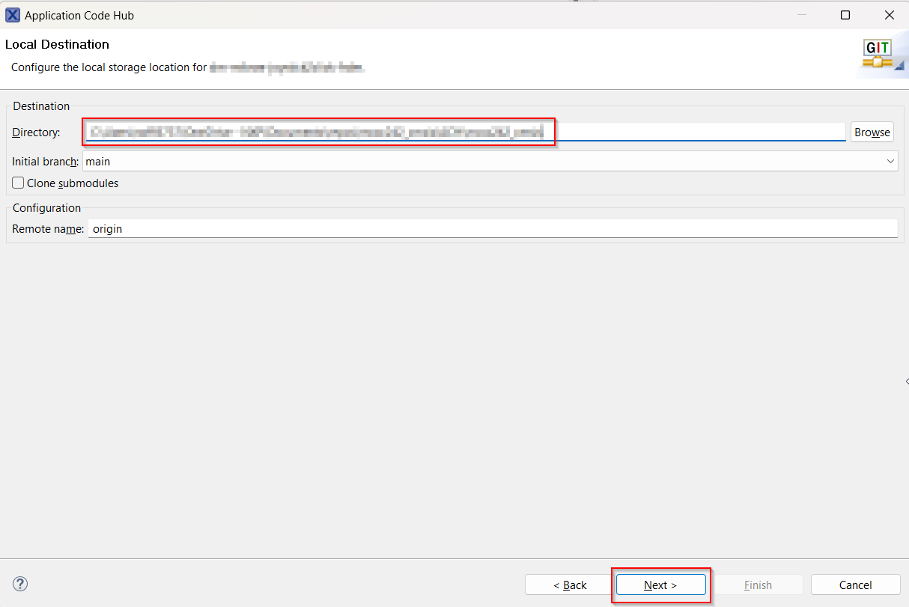
](Images/Local_Destination.png)

select "Import existing Eclipse projects" and click "Next"
[
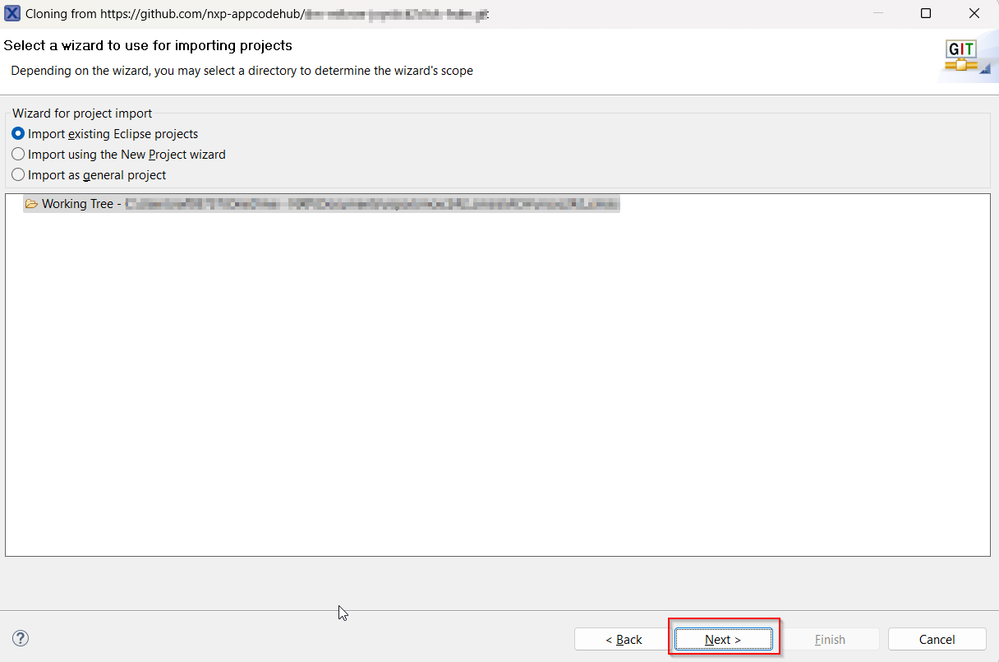
](Images/wizard.png)

import the projects you want and click "Finish"
[
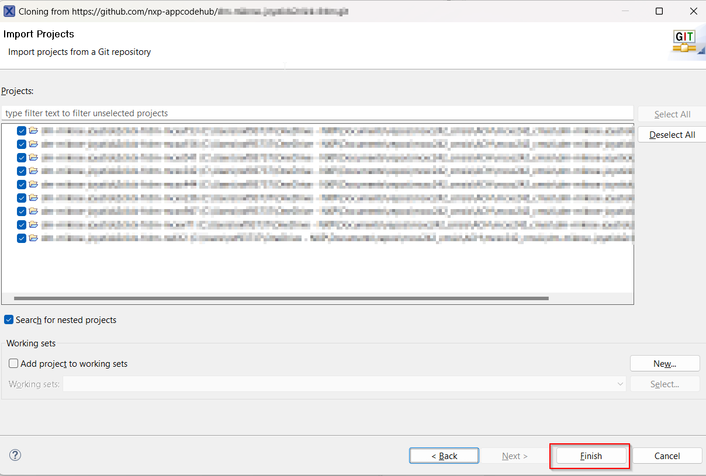
](Images/Import_Projects.png)

### 3.2 Run Project
Once the project is imported select the project folder and expand the hammer button
[
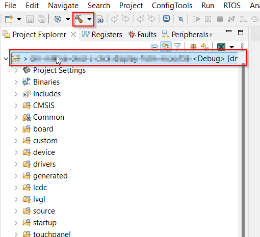
](Images/project_folder.png)

select your build "debug" or "release"
[
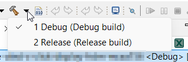
](Images/debug_release.png)

once the project is built select the bug to start the debug process
[
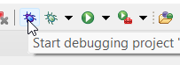
](Images/bug.png)

select your board and click "OK"
[
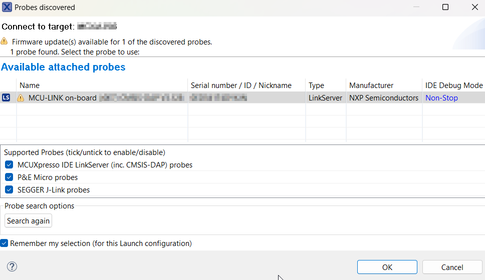
](Images/select_board.png)

finally run the project
[
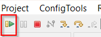
](Images/run.png)

## 4. Results
[

](Images/video_ping_pong.webp)

#### Project Metadata

<!----- Boards ----->

<!----- Categories ----->

<!----- Peripherals ----->

<!----- Toolchains ----->

Questions regarding the content/correctness of this example can be entered as Issues within this GitHub repository.

>**Warning**: For more general technical questions regarding NXP Microcontrollers and the difference in expected functionality, enter your questions on the [NXP Community Forum](https://community.nxp.com/)

## 7. Release Notes
| Version | Description / Update                           | Date                        |
|:-------:|------------------------------------------------|----------------------------:|
| 1.0     | Initial release on Application Code Hub        | October 3rd 2025 |
